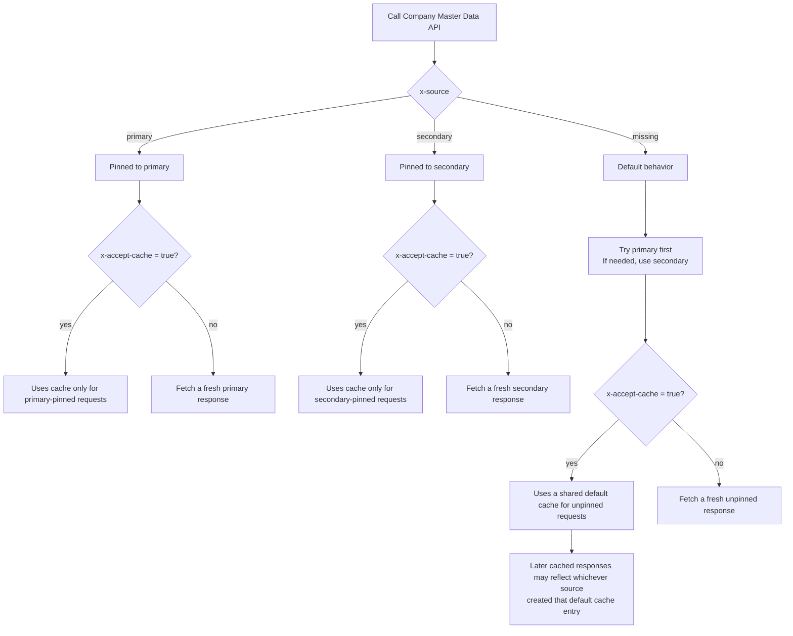

# MCA APIs

MCA APIs help you work with company records sourced from India's Ministry of Corporate Affairs (MCA). Use them when you already know the company's CIN or LLPIN and need its master data, or when you first need to search for the right company before proceeding with an exact lookup.

<Warning>The Director Master Data API has been discontinued.</Warning>

<Note>The active MCA endpoints documented here are Company Master Data and Search Company.</Note>

<CardGroup cols={2}>
  <Card title="Exact company lookup" icon="building">
    Fetch company master data using a Corporate Identification Number (CIN) or Limited Liability Partnership Identification Number (LLPIN).
  </Card>
  <Card title="Search before lookup" icon="magnifying-glass">
    Search the Sandbox database using exact `cin` or partial `company_name` when you do not yet have the final identifier.
  </Card>
  <Card title="KYB and onboarding" icon="shield-check">
    Use MCA company records in vendor onboarding, business verification, and corporate due diligence workflows.
  </Card>
  <Card title="Source-aware retrieval" icon="database">
    The company master data flow supports primary and secondary source selection, along with cache-aware behavior.
  </Card>
</CardGroup>

## How it works

<Steps>
  <Step title="Collect the company input">
    Start with either a `cin`/`llpin` or a company name, depending on what your workflow already knows.
  </Step>

  <Step title="Choose the right endpoint">
    Use Company Master Data for an exact company lookup, or Search Company when you want to find matching companies first.
  </Step>

  <Step title="Send the request">
    Call the MCA endpoint that matches your use case and pass the identifier or search query in the documented request shape.
  </Step>

  <Step title="Use the response in your workflow">
    Prefill forms, validate a business, shortlist matching companies, or continue to downstream KYB checks using the returned data.
  </Step>
</Steps>

## What you can do

<CardGroup cols={2}>
  <Card title="Fetch company profile details" icon="file-lines">
    Retrieve company name, RoC code, category, class, status, registration date, address, and industrial classification.
  </Card>
  <Card title="Lookup using CIN or LLPIN" icon="id-card">
    Use the same `cin` field for both company CIN values and LLPIN values in exact company lookups.
  </Card>
  <Card title="Search by company name" icon="magnifying-glass">
    Search using a partial company name when you need to identify the right company before performing an exact lookup.
  </Card>
  <Card title="Build onboarding flows" icon="circle-check">
    Use MCA data for business verification, merchant onboarding, vendor checks, and internal review workflows.
  </Card>
</CardGroup>

## Source routing and cache behavior

<Info>`x-source` applies to the Company Master Data API. Search Company does not use `x-source`.</Info>

For `POST /kyc/mca/company/master-data`, the response behavior depends on two optional headers:

- `x-source`
- `x-accept-cache`

### How `x-source` behaves

- `x-source: primary` returns the response from the primary source
- `x-source: secondary` returns the response from the secondary source
- if `x-source` is omitted, the API first tries the primary source and can fall back to the secondary source when needed

### How `x-accept-cache` behaves

- `x-accept-cache: true` allows the API to reuse and populate cache
- if `x-accept-cache` is not `true`, the request is treated as cache bypass

In simple terms:

- use `x-source: primary` when you want a vendor-only read
- use `x-source: secondary` when you want a secondary-source read
- omit `x-source` when you want primary-first behavior with fallback to secondary
- use `x-accept-cache: true` when you are okay with cached responses being reused

Important note:

- `x-source: primary` and `x-source: secondary` are cached separately from one another
- when `x-source` is omitted and caching is allowed, the API uses a different default cache behavior
- in that default mode, a later cached response may reflect either the primary source or the secondary source, depending on which one created the cache entry

## Integration methods

<CardGroup cols={2}>
  <Card title="Company Master Data API" icon="building" href="/api-reference/kyc/mca/company_master_data">
    POST endpoint for exact company lookup using `cin`, where `cin` can contain either a CIN or an LLPIN.
  </Card>
  <Card title="Search Company API" icon="magnifying-glass" href="/api-reference/kyc/mca/search_company">
    GET endpoint for searching the Sandbox database using exact `cin` or partial `company_name`, with optional `limit` and `offset`.
  </Card>
  <Card title="Director Master Data API (Discontinued)" icon="id-card" href="/api-reference/kyc/mca/director_master_data">
    Older MCA director endpoint retained in docs for reference. It is no longer active for new integration work.
  </Card>
</CardGroup>

## Common use cases

Use MCA APIs when you need to:

- Fetch master data for a known company using CIN or LLPIN
- Search for companies by name before proceeding with an exact lookup
- Perform KYB during business onboarding
- Validate merchants, vendors, partners, and suppliers
- Replace manual MCA portal checks with an API-first workflow

## Frequently Asked Questions

<AccordionGroup>
  <Accordion title="What is the difference between Company Master Data and Search Company?">
    Company Master Data is for exact lookup when you already know the company's CIN or LLPIN. Search Company is for finding matching companies first using exact `cin` or partial `company_name`.
  </Accordion>

  <Accordion title="Can I pass LLPIN in the cin field?">
    Yes. For the Company Master Data API, the `cin` field can carry either a Corporate Identification Number (CIN) or a Limited Liability Partnership Identification Number (LLPIN).
  </Accordion>

  <Accordion title="Can I search by company name?">
    Yes. Use the Search Company API and pass a partial `company_name`. The endpoint also supports exact `cin` search.
  </Accordion>

  <Accordion title="What does the Search Company API return?">
    Search Company is intended for shortlist and discovery workflows. It returns lightweight company search results that help you identify the correct company before making an exact lookup.
  </Accordion>

  <Accordion title="How do x-source and x-accept-cache work?">
    For Company Master Data, `x-source` controls which source serves the request. `primary` means the primary source, `secondary` means the secondary source, and omitting it gives you primary-first behavior with fallback to secondary when needed. If caching is allowed, primary-pinned and secondary-pinned requests are cached separately, while requests without `x-source` use a separate default cache behavior.
  </Accordion>

  <Accordion title="Is Director Master Data still available?">
    No. The Director Master Data API has been discontinued and should not be used for new integrations.
  </Accordion>
</AccordionGroup>
