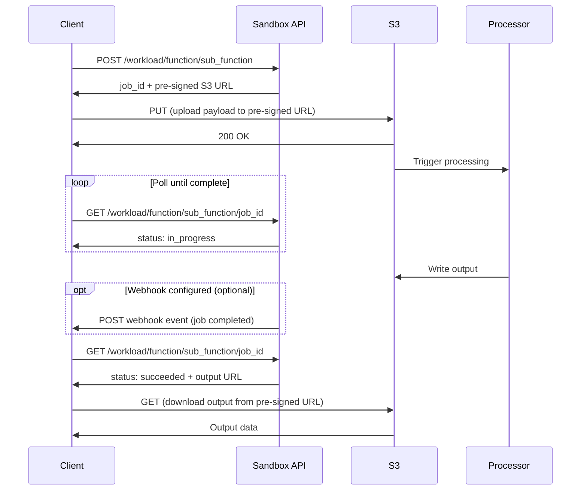

Several Sandbox APIs use an asynchronous, job-based execution model to handle large input payloads and long-running processing reliably.

Instead of sending the full input data directly in the API request, these APIs use a structured workflow:

1. Create a job to initialize processing
2. Upload the input payload separately using a secure pre-signed url
3. Poll the job until processing completes and the output is ready, or use webhooks to receive a completion notification

This approach improves scalability, fault tolerance, and performance, while providing clear visibility into the processing lifecycle.

## How it works

Follow these steps to use job-based APIs:

<Steps>
  <Step title="Submit the job">
    Create a job using a `POST` request to the workload-specific endpoint. This initializes the asynchronous workflow and returns a unique `job_id` and a pre-signed S3 url for uploading the input payload.

**Endpoint pattern**
```http
POST /:workload/:function/:sub_function
```

**Example response**
```json
{
  "code": 200,
  "timestamp": 1767788389433,
  "data": {
    "created_at": 1767788396261,
    "updated_at": 1767788396261,
    "@entity": "in.co.sandbox.it.calculator.tax_pnl.securities.job",
    "security_type": "domestic",
    "url": "https://in-co-sbox-it-calc-tax-pnl-sec-dev.s3.ap-south-1.amazonaws.com/...",
    "status": "created",
    "job_id": "11734cbd-8f18-45ea-9eab-0717a8b3c513"
  },
  "transaction_id": "11734cbd-8f18-45ea-9eab-0717a8b3c513"
}
```

**Response fields**

<ParamField path="job_id" type="string">
  Unique identifier for the job. Use this to upload input data and poll job status.
</ParamField>

<ParamField path="url" type="string">
  Pre-signed AWS S3 URL for uploading the input payload in the next step.
</ParamField>

<ParamField path="status" type="string">
  Initial state of the job. At creation, this will always be `created`.
</ParamField>
  </Step>

  <Step title="Upload the input payload">
    Upload your input payload directly to the pre-signed S3 URL returned in the previous step using a plain HTTP `PUT` request.

    <Warning>
      - The upload URL is an AWS S3 pre-signed URL, **not** a Sandbox API endpoint
      - Do **not** modify the URL in any way
      - Do **not** send Sandbox API keys or authorization headers
      - The URL is time-bound and expires automatically (typically 24 hours)
    </Warning>

    **Request requirements**
    - **Method**: `PUT`
    - **Headers**: `Content-Type` (appropriate for your payload)
    - **Body**: Input payload (JSON, CSV, ZIP, etc.)
    - **No authorization headers required**

    **Example request**
    ```bash cURL
    curl -X PUT 'https://in-co-sandbox-it-calculator-pnl-crypto-dev.s3.ap-south-1.amazonaws.com/...' \
         -H 'Content-Type: application/json' \
         -d @input.json
    ```

    **Successful response**
    ```text
    200 OK
    ```

    Once the payload is uploaded successfully, the job automatically begins processing.
  </Step>

  <Step title="Get job completion status">
    After uploading the input payload, the system processes the job asynchronously. You can poll the same endpoint using a `GET` request with the `job_id` to track progress.

    If you prefer not to poll, configure webhooks to receive a completion notification instead. See [Webhooks](/guides/developer-resources/webhooks). When you receive the webhook, call the same `GET /:workload/:function/:sub_function/:job_id` endpoint to retrieve the output URL.

    **Endpoint pattern**
    ```http
    GET /:workload/:function/:sub_function/:job_id
    ```

    **Job statuses**
    - `created` — Job created and awaiting upload
    - `queued` — Job queued for processing
    - `in_progress` — Job is being processed
    - `succeeded` — Processing complete and output available
    - `failed` — Job failed during processing

    **Example response (in progress)**
    ```json
    {
      "code": 200,
      "timestamp": 1767788517749,
      "data": {
        "created_at": 1767788396261,
        "updated_at": 1767788396261,
        "@entity": "in.co.sandbox.it.calculator.tax_pnl.securities.job",
        "security_type": "domestic",
        "status": "in_progress",
        "job_id": "11734cbd-8f18-45ea-9eab-0717a8b3c513"
      },
      "transaction_id": "1f077f3e-524f-4f96-942a-a0daf7af4f5e"
    }
    ```

    **Example response (succeeded)**
    ```json
    {
      "code": 200,
      "timestamp": 1767788721062,
      "data": {
        "id": "02f12d0c-e7e0-4021-943c-efcc827e6ea9",
        "created_at": 1767788696635,
        "updated_at": 1767788696635,
        "@entity": "in.co.sandbox.it.calculator.pnl.crypto.job",
        "url": "https://in-co-sandbox-it-calculator-pnl-crypto-dev.s3.ap-south-1.amazonaws.com/...",
        "status": "succeeded"
      },
      "transaction_id": "65b8a350-646b-467d-a980-01a38233d2f1"
    }
    ```

    When the job status is `succeeded`, use the `url` field to download the processed result.

    <Tip>
      Implement exponential backoff when polling to avoid rate limits. Start with a 2-second interval and increase gradually.
    </Tip>
  </Step>
</Steps>

## Workflow diagram


