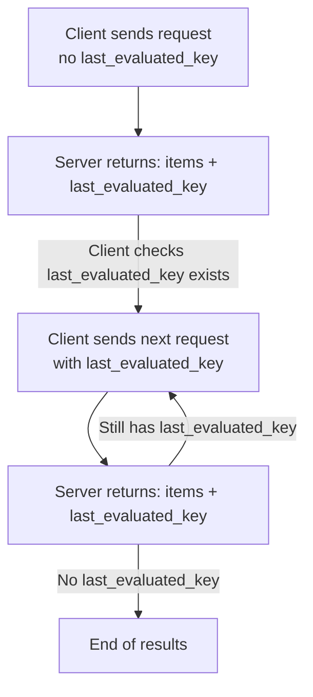

\
List resources endpoint may return paginated items. Each paginated response may include a special value attribute`last_evaluated_key`. Presence of such attribute means **more items are available**. API client must include `last_evaluated_key` in  reuquest body to fetch next page.\
\
Response will not include`last_evaluated_key`for the last page to indicate the end of the list.

## How pagination works

1. Include`page_size `in the request body
1. Response body includes `items`and `last_evaluated_key` 
1. Include `page_size`and `last_evaluated_key` on subsequent request body
4. Repeat until response body does not include`last_evaluated_key` 

<Note>
  Pagination is **forward-only**
</Note>



---

## Key Request Attributes for Pagination

Include following attributes in the request body when using pagination:

| Field                | Type    | Required | Description                                               |
| -------------------- | ------- | -------- | --------------------------------------------------------- |
| `page_size`          | integer | No       | Max items to return per page (up to 50)                   |
| `last_evaluated_key` | string  | No       | Cursor for the next page, returned from previous response |

## Key Response Attributes for Pagination

| Field                | Meaning                            |
| :------------------- | :--------------------------------- |
| `items`              | Results for the current page       |
| `last_evaluated_key` | Present only when more pages exist |

## Example: Fetch Jobs with Pagination

### First Page — Request

```json
{
  "@entity": "in.co.sandbox.tds.reports.jobs.search",
  "tan": "AHMQ00112A",
  "quarter": "Q1",
  "form": "24Q",
  "financial_year": "FY 2024-25",
  "from_date": 1765530000000,
  "to_date": 1765536568538,
  "page_size": 10
}
```

### First Page — Response

```json
{
  "code": 200,
  "timestamp": 1715757773000,
  "transaction_id": "109469b2-0748-4135-a569-e86fc9e45756",
  "data": {
    "@entity": "in.co.sandbox.tds.reports.paginated_list",
    "items": [
      { /* job item */ },
      { /* job item */ },
      { /* job item */ }
    ],
    "last_evaluated_key": "ZDVkMzAyZmUtMWFjYS00YjkxLTgyMWUtMTQxYmM4ZGE1NmNmIA=="
  }
}
```

### Next Page — Request

```json
{
  "@entity": "in.co.sandbox.tds.reports.jobs.search",
  "tan": "AHMQ00112A",
  "quarter": "Q1",
  "form": "24Q",
  "financial_year": "FY 2024-25",
  "from_date": 1765530000000,
  "to_date": 1765536568538,
  "page_size": 10,
  "last_evaluated_key": "ZDVkMzAyZmUtMWFjYS00YjkxLTgyMWUtMTQxYmM4ZGE1NmNmIA=="
}
```

---