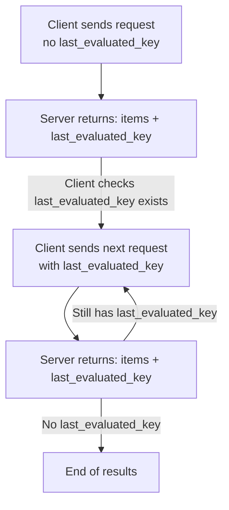

Some list endpoints return a limited set of results at a time. Each paginated response may include a special value called `last_evaluated_key` . If this key exists, it means **more results are available**. Send it again in the subsequent request to fetch the next page. If the key is missing, you’ve reached the end.

---

## How Pagination Works

1. Make the first request **without** `last_evaluated_key`.
2. Receive a page of results. If `last_evaluated_key` appears in the response, there’s another page.
3. Include that key in your next request to continue.
4. Repeat until no `last_evaluated_key` is returned.



---

## Request Attributes for Pagination

Include these attributes in the request body when using pagination:

| Field                | Type    | Required | Description                                               |
| -------------------- | ------- | -------- | --------------------------------------------------------- |
| `page_size`          | integer | No       | Max items to return per page (up to 50)                   |
| `last_evaluated_key` | string  | No       | Cursor for the next page, returned from previous response |

---

## Example: Fetch Jobs with Pagination

### First Page — Request

```json
{
  "@entity": "in.co.sandbox.tds.reports.jobs.search",
  "tan": "AHMA09719B",
  "quarter": "Q1",
  "form": "24Q",
  "financial_year": "FY 2024-25",
  "from_date": 1765530000000,
  "to_date": 1765536568538,
  "page_size": 50
}
```

### First Page — Response

```json
{
  "code": 200,
  "timestamp": 1715757773000,
  "transaction_id": "109469b2-0748-4135-a569-e86fc9e45756",
  "data": {
    "@entity": "in.co.sandbox.tds.reports.paginated_list",
    "items": [
      { /* job item */ },
      { /* job item */ },
      { /* job item */ }
    ],
    "last_evaluated_key": "ZDVkMzAyZmUtMWFjYS00YjkxLTgyMWUtMTQxYmM4ZGE1NmNmIA=="
  }
}
```

### Next Page — Request

```json
{
  "@entity": "in.co.sandbox.tds.reports.jobs.search",
  "tan": "AHMA09719B",
  "quarter": "Q1",
  "form": "24Q",
  "financial_year": "FY 2024-25",
  "from_date": 1765530000000,
  "to_date": 1765536568538,
  "page_size": 50,
  "last_evaluated_key": "ZDVkMzAyZmUtMWFjYS00YjkxLTgyMWUtMTQxYmM4ZGE1NmNmIA=="
}
```

---

## Key Response Properties

| Field                | Meaning                            |
| -------------------- | ---------------------------------- |
| `items`              | Results for the current page       |
| `last_evaluated_key` | Present only when more pages exist |

<Note>
  Pagination is **forward-only**
</Note>