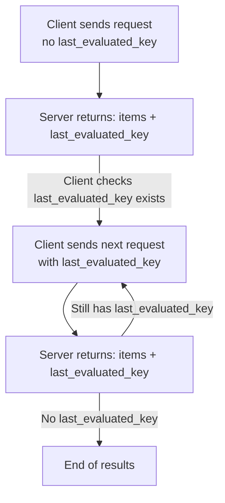

Some list endpoints return results in pages. Each paginated response includes a `last_evaluated_key`, which can be sent again in the next request body to get more results.
If `last_evaluated_key` is not present, you have reached the end.

---

## Supported Pagination Fields

Include these fields in the **request body**:

| Field                | Type    | Required | Description                                                                                    |
| -------------------- | ------- | -------- | ---------------------------------------------------------------------------------------------- |
| `from_date`          | integer | No       | Start timestamp (Epoch ms) to filter jobs from                                                 |
| `to_date`            | integer | No       | End timestamp (Epoch ms) to filter jobs till                                                   |
| `page_size`          | integer | No       | Max items to return per page (up to 50)                                                        |
| `last_evaluated_key` | string  | No       | Cursor to continue fetching next page. This is a Base64 encoded value generated by the system. |

> Note: Always pass `last_evaluated_key` exactly as returned.
> It is **opaque** — do not decode or modify it.

---

## How to Use Pagination

1. Send the first request **without** `last_evaluated_key`.
2. Check for `data.last_evaluated_key` in the response.
3. If present, include it in the next request body to fetch the next page.
4. Stop when the key no longer appears.

---




## Example
Fetch Jobs (with pagination)

### Request — First Page

```json
{
  "@entity": "in.co.sandbox.tds.reports.jobs.search",
  "tan": "AHMA09719B",
  "quarter": "Q1",
  "form": "24Q",
  "financial_year": "FY 2024-25",
  "from_date": 123,
  "to_date": 123,
  "page_size": 50
}
```

### Response

```json
{
  "code": 200,
  "timestamp": 1715757773000,
  "transaction_id": "109469b2-0748-4135-a569-e86fc9e45756",
  "data": {
    "@entity": "in.co.sandbox.tds.reports.paginated_list",
    "items": [
      { /* job item */ },
      { /* job item */ },
      { /* job item */ }
    ],
    "last_evaluated_key": "eydadadadada...=="
  }
}
```

### Request — Next Page

```json
{
  "@entity": "in.co.sandbox.tds.reports.jobs.search",
  "tan": "AHMA09719B",
  "quarter": "Q1",
  "form": "24Q",
  "financial_year": "FY 2024-25",
  "from_date": 123,
  "to_date": 123,
  "page_size": 50,
  "last_evaluated_key": "eydadadadada...=="
}
```

---

## Key Fields in Response

* `items` — results for this page
* `last_evaluated_key` — only present when more pages exist

Pagination is **forward-only**.

---
